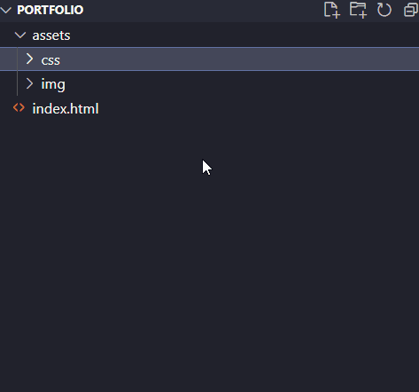
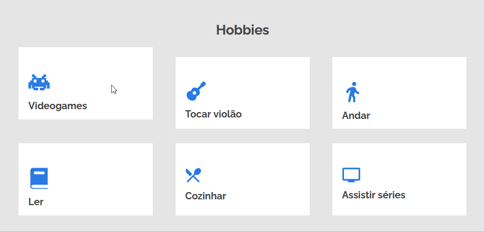

# Portfólio Front-End
Esse é mais um desafio da Formação Alura-ONE (Turma 5): um portfólio responsivo desenvolvido com HTML5 e CSS3.

## Sobre o portfólio
Bem-vindo ao meu portfólio Front-End! Uma página responsiva desenvolvida com as melhores práticas. 
Se quiser ver ele rodando é só clicar [aqui](https://amigodalua.github.io/portfolio-front/). Abaixo, um resumo dos principais pontos do projeto:

### CSS com BEM
No CSS apliquei a metodologia BEM (Block/Element/Modifier) para construir um código claro e de fácil manutenção.

  
### Responsividade
A página foi pensada para funcionar em smartphones, tablets e desktops. Então não tem tempo ruim!

  
### Visual
Sou fã dos detalhes que enriquecem, então adicionei algumas pequenas animações que dão vida à página (em sua versão desktop).

  
  
  
### Formulário de contato
No pé da página coloquei um formulário que, graças ao [formsubmit.co](https://formsubmit.co/), envia para mim a sua mensagem de contato.
  
### Curiosidade
Atualmente estou mergulhando no universo Front-End (com muito HTML/CSS/JavaScript) mas comecei meus estudos de programação com Python.
Cheguei até mesmo a fazer um outro portfólio, focado em projetos desenvolvidos em Flask. 
Você pode dar uma olhada no repo desse portfólio antigo [clicando aqui](https://github.com/AmigoDaLua/Portfolio) ou, 
pra ver ele rodando, é só [clicar aqui](https://portfolio-ms95.onrender.com/).
